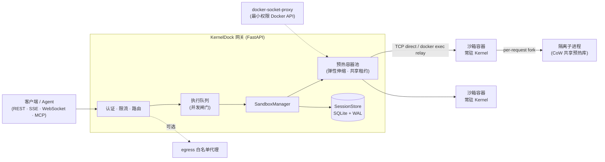

# KernelDock

KernelDock 是一个面向 LLM、Agent 和数据分析应用的 Python 沙箱执行服务。它通过 FastAPI 暴露统一 API，把用户代码放进受限 Docker 容器执行，并返回结构化结果：`stdout`、`stderr`、图表、表格、图片、队列信息和执行元数据。

这个项目的目标不是做一个通用 Notebook 替代品，而是提供一个适合生产环境接入的“代码执行后端”：对上游 Agent 足够友好，对运维和安全团队也足够可控。

## 为什么用它

相比“直接起一个 Python 子进程”或“临时拉一个一次性容器”，这个项目的优势主要在四点：

- 对 Agent 友好：返回的不是单一文本，而是图表、表格、文件和执行元信息，便于直接接入多模态或数据分析工作流。
- 延迟更低：无状态请求可直接从预热容器池借容器执行，避免每次冷启动 Python 环境。
- 会话能力更完整：有状态模式下容器内常驻 Kernel Server，多轮对话可以保留变量、已加载数据和执行上下文。
- 安全边界更明确：基于 AST 校验、只读根文件系统、非 root、禁网、资源限制和可选 gVisor，默认就朝着“最小权限”收敛。

## 核心特性

- Stateless + Stateful 双模式执行
- 预热容器池，降低短任务冷启动开销
- 容器内常驻 Python Kernel，支持变量跨轮保持
- 自动收集 matplotlib / seaborn 图表输出
- 自动提取表格结果、图片结果和输出文件
- 支持 REST、SSE 流式执行和 WebSocket 实时输出
- 支持文件上传、共享数据目录、只读挂载和结果下载
- 暴露 Prometheus 指标、健康检查、全局统计和队列状态
- 支持容器级资源限制、会话超时和空闲回收
- Shell 命令执行（与代码执行同一隔离边界）
- 容器内文件系统 API（list / read / write / delete，目录白名单）
- 运行时 pip 装包（egress 白名单代理模式下）
- 长时后台任务（异步提交 + 轮询，不阻塞同步请求）
- MCP server 包装，任何 MCP 客户端（Claude / Cursor 等）可直接接入
- 分布式多节点部署：无状态 router + 节点自注册，`docker compose up -d` 或 `kubectl scale` 即可加节点

## 适用场景

- 给大模型提供“可执行 Python”能力
- 数据分析 Copilot / BI Agent / Auto-EDA 工具
- 需要图表和表格结构化返回的聊天式分析应用
- 需要隔离执行用户代码的后端服务

## 非目标

- 不是多租户 Notebook 平台
- 不是通用任意语言代码运行器
- 不默认支持联网抓数场景，沙箱网络默认关闭

## 架构概览



执行路径有两种：

- 无状态模式：从预热池借用容器，执行结束后清理 namespace 并归还池中。
- 有状态模式：为 session 绑定沙箱，适合多轮分析、反复调试和跨请求复用变量。

多机水平扩展时，前置一个无状态 router 把流量分发到多个网关节点（见下文「分布式多节点部署」）。

## 项目亮点

### 1. 更适合 LLM 的结果结构

很多代码执行服务只返回一段文本，本项目会把执行结果拆成机器更容易消费的结构：

- `stdout` / `stderr`
- `charts`
- `tables`
- `images`
- `queue_info`
- `sandbox_info`
- `execution_info`

这意味着上游 Agent 可以更稳定地决定“展示图表”“继续追问”“下载文件”“提示用户等待”，而不是从原始文本里猜。

### 2. 冷启动影响更小

沙箱容器池会提前预热容器。对于短时分析请求，这比“每次都新建容器”更接近在线服务的响应模型。

### 3. 会话语义更自然

有状态模式下，容器内 `kernel_server.py` 常驻，变量、导入模块和部分上下文可以跨轮保留，更贴近用户对“继续在刚才环境里分析”的直觉。

### 4. 默认更保守的安全配置

默认安全策略包括：

- AST 静态校验
- 容器内非 root 用户
- 只读 root filesystem
- 默认禁用网络
- CPU / 内存 / 磁盘 / PIDs 限制
- 会话空闲超时和最大生命周期控制
- 可选启用 gVisor 进一步强化隔离

## 快速开始

### 前置要求

- Docker Engine
- Docker Compose
- Linux 容器环境

推荐机器配置：

- 开发环境：4C8G
- 生产环境：按并发和单沙箱资源限制放大

### 1. 构建沙箱镜像

Linux / macOS：

```bash
./build.sh all
```

如果你在 Windows 上，建议使用 Git Bash / WSL；或者手动执行：

```bash
docker build -f Dockerfile.base -t kerneldock-sandbox-base:latest .
docker build --build-arg BASE_IMAGE=kerneldock-sandbox-base:latest -f Dockerfile.sandbox -t kerneldock-sandbox:v2.0.0 .
```

### 2. 启动网关服务

```bash
docker compose up -d --build
```

仓库自带 `docker-compose.yml` 默认会：

- 构建并启动 FastAPI 网关
- 对外暴露 `9527` 端口
- 通过 Docker socket 管理沙箱子容器
- 使用 `kerneldock-sandbox:v2.0.0` 作为默认沙箱镜像

### 3. 验证服务

```bash
curl http://localhost:9527/health
```

## 快速体验

### 无状态执行

```bash
curl -X POST http://localhost:9527/execute \
  -H "Content-Type: application/json" \
  -d '{
    "code": "import pandas as pd\nimport matplotlib.pyplot as plt\ndf = pd.DataFrame({\"x\":[1,2,3],\"y\":[2,4,8]})\nprint(df.describe())\ndf.plot(x=\"x\", y=\"y\")",
    "timeout": 30
  }'
```

示例响应字段：

```json
{
  "success": true,
  "stdout": "...",
  "stderr": "",
  "charts": [{"format": "svg", "base64": "PHN2Zy...", "path": null}],
  "tables": [],
  "images": [],
  "queue_info": {"position_on_entry": 0, "waited_seconds": 0.0},
  "sandbox_info": {"mode": "stateless_pool_kernel", "pool_available": 3, "pool_total": 4},
  "execution_info": {"execution_time_ms": 142, "chart_count": 1, "table_count": 0}
}
```

### 有状态会话

```bash
curl -X POST http://localhost:9527/sessions -H "Content-Type: application/json" -d '{}'
curl -X POST http://localhost:9527/sessions/<session_id>/execute \
  -H "Content-Type: application/json" \
  -d '{"code": "x = 42\nprint(x)"}'
curl -X POST http://localhost:9527/sessions/<session_id>/execute \
  -H "Content-Type: application/json" \
  -d '{"code": "print(x + 1)"}'
```

第二次执行可以直接复用第一次留下的变量。

## API 概览

### 系统接口

| Method | Path | Description |
|------|------|------|
| GET | `/health` | 健康检查，返回池状态和资源占用 |
| GET | `/metrics` | Prometheus 指标导出 |
| GET | `/statistics` | 全局统计信息 |
| GET | `/queue/status` | 当前执行队列状态 |
| POST | `/cleanup` | 清理过期会话 |

### 执行接口

| Method | Path | Description |
|------|------|------|
| POST | `/execute` | 无状态执行，推荐用于 Agent 场景 |
| POST | `/sessions` | 创建会话（可选 `cpu_limit`/`memory_limit_mb`/`disk_limit_mb`/`pids_limit` 分配资源） |
| GET | `/sessions/{id}` | 查询会话信息 |
| DELETE | `/sessions/{id}` | 删除会话和关联沙箱 |
| POST | `/sessions/{id}/execute` | 有状态执行 |
| POST | `/v2/sessions/{id}/execute` | SSE 流式执行 |
| WS | `/ws` | WebSocket 实时输出 |

### 数据与文件接口

| Method | Path | Description |
|------|------|------|
| POST | `/sessions/{id}/upload` | 上传文件 |
| POST | `/sessions/{id}/load-data` | 加载 JSON 数据为文件 |
| GET | `/sessions/{id}/schemas` | 获取表结构 |
| GET | `/sessions/{id}/context` | 获取多表上下文 |
| GET | `/sessions/{id}/contexts` | 列出上下文快照 |
| POST | `/sessions/{id}/contexts` | 创建上下文快照 |
| GET | `/sessions/{id}/files` | 列出文件 |
| GET | `/sessions/{id}/files/{type}/{name}` | 下载文件 |

### Agent 扩展接口

| Method | Path | Description |
|------|------|------|
| POST | `/sessions/{id}/shell` | 会话沙箱内执行 shell 命令 |
| POST | `/execute/shell` | 无状态 shell 执行（独占租约 + kernel 健康检查） |
| GET | `/sessions/{id}/fs/list` | 列出容器内目录（白名单：/data /output /tmp /home/sandbox） |
| GET | `/sessions/{id}/fs/read` | 读取容器内文件（base64） |
| PUT | `/sessions/{id}/fs/write` | 写入容器内文件（自动建父目录） |
| DELETE | `/sessions/{id}/fs` | 删除容器内文件/目录 |
| POST | `/sessions/{id}/packages` | 运行时 pip 装包（需 egress proxy 模式） |
| POST | `/jobs` | 提交长时后台任务（异步） |
| GET | `/jobs` | 列出后台任务 |
| GET | `/jobs/{id}` | 查询任务状态与结果 |
| DELETE | `/jobs/{id}` | 取消任务 |

### 沙箱管理接口

| Method | Path | Description |
|------|------|------|
| GET | `/sandboxes` | 列出活跃沙箱 |
| GET | `/sandboxes/{id}` | 查询沙箱详情 |
| DELETE | `/sandboxes/{id}` | 强制销毁沙箱 |
| GET | `/sandboxes/{id}/metrics` | 查询沙箱资源指标 |
| GET | `/resource-config` | 查看资源默认值 / 软上限 / 绝对护栏（只读） |
| PUT | `/admin/resource-config` | 运行时调整资源默认值 / 上限（admin token，热生效 + 持久化） |
| GET | `/admin/console` | 可视化运维 + 资源配置控制台页面（浏览器直接打开） |

## MCP 接入

仓库自带 MCP server 包装（`mcp_server/kerneldock_mcp.py`），把执行 / shell / 文件 / 装包 / 后台任务全部暴露为 MCP 工具，Claude Desktop、Cursor 等 MCP 客户端零成本接入：

```bash
pip install -r requirements-mcp.txt
```

客户端配置示例：

```json
{
  "mcpServers": {
    "kerneldock": {
      "command": "python",
      "args": ["/path/to/mcp_server/kerneldock_mcp.py"],
      "env": {
        "KERNELDOCK_URL": "http://localhost:9527",
        "KERNELDOCK_API_KEY": "your-api-key"
      }
    }
  }
}
```

提供的工具：`execute_python`、`create_session` / `execute_in_session` / `delete_session`、`run_shell`、`list_files` / `read_file` / `write_file`、`install_packages`、`submit_job` / `get_job`、`get_chart`。

端到端验证：`python tests/mcp_e2e.py`（官方 mcp SDK stdio 客户端逐个实调全部 12 个工具）。

## 分布式多节点部署

多台服务器水平扩展沙箱并发：每台节点机照常 `docker compose up -d`（节点侧零改动），再起一个无状态 router 把流量按规则分发（设计详见 `deploy/distributed-design.md`）：

```bash
# router 机器
ROUTER_NODES="n1=http://10.0.0.1:9527,n2=http://10.0.0.2:9527" \
  docker compose -f docker-compose.router.yml up -d
# 客户端 base_url 改为 http://<router>:9500，其余零感知
```

- **无状态执行**（`/execute`、`/execute/shell`、无 session 的 `/jobs`）按各节点队列水位分发到最闲节点——N 节点 ≈ N 倍无状态吞吐
- **会话/任务粘性**：创建类响应里的 `session_id` / `job_id` / `sandboxID` 自动带上节点前缀（如 `n1:uuid`），后续请求按前缀直达所属节点；ID 对客户端是不透明字符串，SDK / MCP / E2B 适配层零感知
- **聚合观测**：router 的 `/health` 汇总全部节点，`/metrics` 同时输出 router 自身指标（`router_schedule_total` 等）与各节点指标（自动注入 `node` label），`/jobs`、`/sandboxes` 跨节点合并；`X-Request-Id` 贯穿 router→node 便于链路排障
- **高可用**：router 完全无状态，多跑几个实例 + DNS 轮询/VIP 即可；节点宕机后其会话丢失（客户端重建），无状态流量秒级摘除；优雅停机（drain + graceful shutdown）滚动更新不切在途请求
- **安全默认**：router 管理端点（注册/摘除节点）未配 `ROUTER_ADMIN_TOKEN` 时默认拒绝写操作（防注册劫持），生产务必设令牌；本地可信网络可设 `ROUTER_ALLOW_INSECURE_ADMIN=true` 放行

**加节点 = 一条命令**（节点自注册）：新机器上

```bash
ROUTER_URL=http://<router>:9500 NODE_NAME=n3 \
  NODE_ADVERTISE_URL=http://<本机IP>:9527 docker compose up -d
```

节点启动即自动注册进集群并周期心跳（默认 10s）；心跳断超过 `ROUTER_NODE_TTL`（默认 30s）自动摘除，重启自动回归。也可以不用自注册，在 router 的 `ROUTER_NODES` 静态配置节点表。`GET /admin/nodes` 查看集群成员（可用 `ROUTER_ADMIN_TOKEN` 保护管理端点）。

端到端验证：`python tests/router_e2e.py`（路由/粘性/聚合）、`python tests/router_phase2_e2e.py`（自注册/心跳/摘除/回归），单机可用 `docker-compose.node2.yml` 模拟第二节点。

K8s 集群形态见 `deploy/k8s/kerneldock-cluster.yaml`（router + node 双 StatefulSet，`kubectl scale` 即扩缩节点，详见 `deploy/k8s/README.md`）。

## 响应结构

执行 API 会在结果中补充三类对上游很有用的元数据：

### `queue_info`

反映请求是否排队、等了多久、当前系统拥塞程度。

### `sandbox_info`

反映执行使用的沙箱模式、资源限制、容器池状态和沙箱实例信息。

### `execution_info`

反映执行耗时、超时配置、代码大小、图表数量、表格数量、输出是否被截断等。

这三块信息对于前端状态提示、重试策略、限流决策和观测分析都很有价值。

## 安全模型

这是一个“面向不可信代码的隔离执行器”，但它不是无限安全的。推荐把它看作分层防护的一部分。

已实现的主要防护：

- 容器隔离
- 非 root 用户运行
- 只读根文件系统
- 默认 `network=none`
- AST 静态校验
- 资源限制与超时控制
- 可选 gVisor 运行时

生产环境建议：

- 使用专用 Docker 主机或节点池承载沙箱
- 不要直接暴露 Docker socket，建议配合 docker-socket-proxy
- 严格设置 `CORS_ALLOWED_ORIGINS`
- 关闭本地回退模式：`SANDBOX_ALLOW_LOCAL_FALLBACK=false`
- 根据业务规模调优容器池和资源限制

## 供应链与镜像安全

CI（`.github/workflows/code-executor-ci.yml`）在语法门禁 + 单元测试之外，还有两道供应链防线：

- **依赖审计**（`pip-audit`）：网关 / router / MCP 三个入口依赖一旦出现「有修复版本」的已知漏洞即挡红；沙箱数据科学全家桶仅告警（这类 CVE 多不可利用、上游修复滞后，强行阻断会让 PR 无法合入，高危项人工评估后在 `requirements.lock` 升级）。
- **镜像扫描**（Trivy）：构建网关与 router 镜像后分层扫描——**应用库层**（我们 `requirements` 装的包）命中高危/严重即挡红；**基础镜像 OS 层**（debian 包）仅告警，避免被上游 base 镜像的补丁节奏绑架。两个 Dockerfile 均 `apt-get upgrade` 拉安全补丁并升级 pip 工具链，把可控漏洞治本清零。
- 误报或「已评估不可利用」的 CVE 在 `.trivyignore` 登记（需写明理由与复核日期）。

本地复现：

```bash
pip install pip-audit
pip-audit -r requirements-gateway.txt -r requirements-router.txt -r requirements-mcp.txt
# 镜像扫描（需 Docker）
docker build -t kerneldock:ci . && trivy image --severity CRITICAL,HIGH --ignore-unfixed kerneldock:ci
```

## 关键配置

下面的值以仓库自带 `docker-compose.yml` 为例：

| 变量 | 默认值 | 说明 |
|------|--------|------|
| `SANDBOX_DOCKER_IMAGE` | `kerneldock-sandbox:v2.0.0` | 沙箱镜像标签 |
| `SANDBOX_POOL__POOL_SIZE` | `2` | 常态预热容器数 |
| `SANDBOX_POOL__MIN_POOL_SIZE` / `MAX_POOL_SIZE` | `1` / `4` | 弹性伸缩下/上限：空闲缩容、借空与高水位扩容 |
| `SANDBOX_POOL__SHARED_STATELESS` | `true` | 无状态执行共享池容器并发 fork（单租户密度更高；多租户置 `false`） |
| `SANDBOX_QUEUE__MAX_CONCURRENT_EXECUTIONS` | `16` | 执行队列并发闸门（共享租约下 ≈ 池 × 单容器并发） |
| `SANDBOX_RESOURCE__DEFAULT_CPU` / `DEFAULT_MEMORY_MB` | `1.0` / `512` | 单沙箱默认 CPU / 内存限额 |
| `SANDBOX_RESOURCE__MAX_CPU` / `MAX_MEMORY_MB` | `2.0` / `2048` | 单沙箱可分配的 CPU / 内存软上限（现已真实生效，超限自动收敛）|
| `SANDBOX_TIMEOUT__EXECUTION_TIMEOUT` / `SESSION_IDLE_TIMEOUT` | `300` / `600` | 单次执行超时 / 会话空闲超时 |
| `SANDBOX_KERNEL_TRANSPORT` | `direct` | `direct`=TCP 直连（低延迟）；`relay`=docker exec 中继（物理禁网更保守） |
| `SANDBOX_NETWORK__EGRESS_MODE` | `none` | `none`=禁网；`proxy`=经白名单代理出站（pip 装包需此模式） |
| `SANDBOX_API_KEYS` | 空 | 逗号分隔；留空禁用认证（仅限开发，生产必配） |
| `CORS_ALLOWED_ORIGINS` | 空 | 开发可留空，生产务必收紧 |

经验上，4C8G 机器可以从 `pool_size=2`（弹性上限 4）、`memory=512MB` 起步，再根据真实负载调整。

## 资源配置与分配管理

沙箱资源（CPU / 内存 / 磁盘 / 进程数）采用「三层模型」，既能给单个沙箱按需分配，也能在运行时统一管控上限：

- **默认值（default）**：创建会话沙箱或预热池容器时，未显式指定资源就用这套默认值。
- **软上限（max）**：单沙箱可分配的上限。请求超过软上限会自动收敛（clamp）到上限，不会报错。
- **绝对护栏（guardrail）**：无论怎么配置都不可逾越的物理 / 安全天花板，软上限只能在护栏区间内收紧。

> 此前 `SANDBOX_RESOURCE__MAX_*` 配置并未真正参与限制（被硬编码常量覆盖），现已修复为真实生效。磁盘限制依赖底层存储驱动（overlay2 + xfs/quota），当前作为元数据记录与展示；进程数（pids）通过容器 `pids_limit` 生效。

### 1. 为单个会话沙箱分配资源

创建会话时可直接指定该沙箱的资源（仅在 Docker 沙箱模式下生效，超软上限自动收敛）：

```bash
curl -X POST http://localhost:9527/sessions \
  -H "Content-Type: application/json" \
  -d '{"cpu_limit": 2, "memory_limit_mb": 1024, "disk_limit_mb": 2048, "pids_limit": 200}'
```

响应会回显实际分配（经软上限收敛后）的资源：

```json
{
  "session_id": "…",
  "workspace_dir": "…", "data_dir": "…", "output_dir": "…",
  "cpu_limit": 2.0, "memory_limit_mb": 1024, "disk_limit_mb": 2048, "pids_limit": 200
}
```

### 2. 查看当前资源配置

```bash
curl http://localhost:9527/resource-config
```

返回当前默认值、软上限、绝对护栏区间与持久化状态，便于运维查看或 Agent 自适应决定分配多少资源。

### 3. 运行时调整默认值 / 上限（管理端）

无需重启即可调整资源默认值与软上限；变更立即热生效，并持久化到 `$WORKSPACE_DIR/resource_config.json`（重启后仍保留）。需配置并携带 `SANDBOX_ADMIN_TOKEN`：

```bash
curl -X PUT http://localhost:9527/admin/resource-config \
  -H "X-Admin-Token: $SANDBOX_ADMIN_TOKEN" \
  -H "Content-Type: application/json" \
  -d '{"max_cpu": 3, "max_memory_mb": 3072, "default_memory_mb": 768}'
```

- 仅传需要修改的字段，省略的保持不变；
- 超出绝对护栏的值自动收敛，默认值不得超过软上限（超过则下调到上限）；
- 修改默认值影响「新建」容器；已有预热池容器在老化轮替后采用新值。

### 4. 可视化控制台（推荐）

不想敲 curl？浏览器直接打开内置控制台，像 RabbitMQ Management 那样点选操作：

```
http://localhost:9527/admin/console
```

控制台是一个自包含页面（无需单独部署前端），分为四个 Tab：

- **概览**：服务状态、活跃沙箱、容器池可用/总数、CPU/内存占用、运行时长、队列排队/执行中/并发上限（每 5s 自动刷新，可关）。
- **沙箱**：活跃沙箱列表（资源限额、状态、网络、创建时间），支持一键**销毁**。
- **队列 & 统计**：`/queue/status` 与 `/statistics` 的完整字段展示。
- **资源配置**：表格内直接编辑默认值 / 软上限，点「保存配置」即热生效并持久化；超护栏的值自动收敛并在页面提示。

使用说明：

- 顶部填入 **API Key**（若服务启用了 `SANDBOX_API_KEYS`，否则留空）与 **Admin Token**（对应 `SANDBOX_ADMIN_TOKEN`，保存配置/销毁沙箱等写操作必填），凭证仅存浏览器本地 localStorage；
- 页面本身已在认证中间件中豁免（浏览器可直开），但其调用的数据接口仍受 API Key 保护、写操作另需 admin token。生产环境建议再用反向代理 / 网络策略限制 `/admin/*` 的访问来源。

## 可观测性

项目内置了面向运维的基础观测能力：

- `/health`：服务健康、池状态、依赖状态
- `/metrics`：Prometheus 指标导出
- `/statistics`：聚合统计
- `/queue/status`：执行队列状态
- 沙箱级 CPU / 内存 / 磁盘 / 网络指标

如果你要把它接进生产环境，这是比“能跑代码”更重要的一部分。

## 开发与测试

单元测试（无需 Docker，CI 同款子集）：

```bash
pytest -q \
  --ignore=tests/integration \
  --ignore=tests/test_enriched_response.py \
  --ignore=tests/mcp_e2e.py \
  --ignore=tests/router_e2e.py \
  --ignore=tests/router_phase2_e2e.py
```

面向运行中服务的端到端脚本（需先启动网关，独立运行，不被 pytest 收集）：

```bash
# MCP 全工具实连（官方 mcp SDK stdio 客户端）
python tests/mcp_e2e.py
# 分布式 router：路由/粘性/聚合，以及自注册/心跳/摘除
python tests/router_e2e.py
python tests/router_phase2_e2e.py
# 增强响应与并发压测
python tests/test_enriched_response.py --url http://localhost:9527
python tests/stress_test.py --url http://localhost:9527 --scenario all -c 10 -n 30
```

单元测试覆盖：容器池与会话管理、流式执行与增强响应、指标导出与管理接口、
数据上下文隔离、卷挂载、会话持久化、API Key 校验、router 路由/调度/节点生命周期等。

## 路线方向

适合继续增强的方向包括：

- 更细粒度的镜像分层与依赖裁剪、更短的冷启动
- 更明确的 API 文档和 OpenAPI 示例
- 更丰富的沙箱策略配置与审计日志
- Helm Chart 与真实多节点集群的部署验证
- gVisor 强隔离在 Linux 宿主上的性能基线
- E2B 官方 SDK 的协议级（envd / WSS）兼容

## 贡献

欢迎提交 Issue 和 PR。比较有价值的贡献方向：

- 新的安全策略或隔离增强
- 更稳定的图表 / 表格提取能力
- 观测性、压测和基准测试改进
- 文档、示例客户端和部署模板

如果你计划做较大改动，建议先开一个 Issue 对齐设计和边界。

## License

MIT
