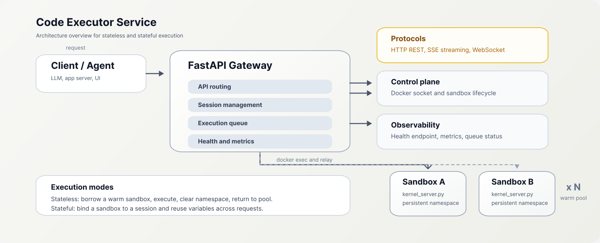

# KernelDock

KernelDock 是一个面向 LLM、Agent 和数据分析应用的 Python 沙箱执行服务。它通过 FastAPI 暴露统一 API，把用户代码放进受限 Docker 容器执行，并返回结构化结果：`stdout`、`stderr`、图表、表格、图片、队列信息和执行元数据。

这个项目的目标不是做一个通用 Notebook 替代品，而是提供一个适合生产环境接入的“代码执行后端”：对上游 Agent 足够友好，对运维和安全团队也足够可控。

## 为什么用它

相比“直接起一个 Python 子进程”或“临时拉一个一次性容器”，这个项目的优势主要在四点：

- 对 Agent 友好：返回的不是单一文本，而是图表、表格、文件和执行元信息，便于直接接入多模态或数据分析工作流。
- 延迟更低：无状态请求可直接从预热容器池借容器执行，避免每次冷启动 Python 环境。
- 会话能力更完整：有状态模式下容器内常驻 Kernel Server，多轮对话可以保留变量、已加载数据和执行上下文。
- 安全边界更明确：基于 AST 校验、只读根文件系统、非 root、禁网、资源限制和可选 gVisor，默认就朝着“最小权限”收敛。

## 核心特性

- Stateless + Stateful 双模式执行
- 预热容器池，降低短任务冷启动开销
- 容器内常驻 Python Kernel，支持变量跨轮保持
- 自动收集 matplotlib / seaborn 图表输出
- 自动提取表格结果、图片结果和输出文件
- 支持 REST、SSE 流式执行和 WebSocket 实时输出
- 支持文件上传、共享数据目录、只读挂载和结果下载
- 暴露 Prometheus 指标、健康检查、全局统计和队列状态
- 支持容器级资源限制、会话超时和空闲回收

## 适用场景

- 给大模型提供“可执行 Python”能力
- 数据分析 Copilot / BI Agent / Auto-EDA 工具
- 需要图表和表格结构化返回的聊天式分析应用
- 需要隔离执行用户代码的后端服务

## 非目标

- 不是多租户 Notebook 平台
- 不是通用任意语言代码运行器
- 不默认支持联网抓数场景，沙箱网络默认关闭

## 架构概览



执行路径有两种：

- 无状态模式：从预热池借用容器，执行结束后清理 namespace 并归还池中。
- 有状态模式：为 session 绑定沙箱，适合多轮分析、反复调试和跨请求复用变量。

## 项目亮点

### 1. 更适合 LLM 的结果结构

很多代码执行服务只返回一段文本，本项目会把执行结果拆成机器更容易消费的结构：

- `stdout` / `stderr`
- `charts`
- `tables`
- `images`
- `queue_info`
- `sandbox_info`
- `execution_info`

这意味着上游 Agent 可以更稳定地决定“展示图表”“继续追问”“下载文件”“提示用户等待”，而不是从原始文本里猜。

### 2. 冷启动影响更小

沙箱容器池会提前预热容器。对于短时分析请求，这比“每次都新建容器”更接近在线服务的响应模型。

### 3. 会话语义更自然

有状态模式下，容器内 `kernel_server.py` 常驻，变量、导入模块和部分上下文可以跨轮保留，更贴近用户对“继续在刚才环境里分析”的直觉。

### 4. 默认更保守的安全配置

默认安全策略包括：

- AST 静态校验
- 容器内非 root 用户
- 只读 root filesystem
- 默认禁用网络
- CPU / 内存 / 磁盘 / PIDs 限制
- 会话空闲超时和最大生命周期控制
- 可选启用 gVisor 进一步强化隔离

## 快速开始

### 前置要求

- Docker Engine
- Docker Compose
- Linux 容器环境

推荐机器配置：

- 开发环境：4C8G
- 生产环境：按并发和单沙箱资源限制放大

### 1. 构建沙箱镜像

Linux / macOS：

```bash
./build.sh all
```

如果你在 Windows 上，建议使用 Git Bash / WSL；或者手动执行：

```bash
docker build -f Dockerfile.base -t code-executor-sandbox-base:latest .
docker build --build-arg BASE_IMAGE=code-executor-sandbox-base:latest -f Dockerfile.sandbox -t code-executor-sandbox:v2.0.0 .
```

### 2. 启动网关服务

```bash
docker compose up -d --build
```

仓库自带 `docker-compose.yml` 默认会：

- 构建并启动 FastAPI 网关
- 对外暴露 `9527` 端口
- 通过 Docker socket 管理沙箱子容器
- 使用 `code-executor-sandbox:v2.0.0` 作为默认沙箱镜像

### 3. 验证服务

```bash
curl http://localhost:9527/health
```

## 快速体验

### 无状态执行

```bash
curl -X POST http://localhost:9527/execute \
  -H "Content-Type: application/json" \
  -d '{
    "code": "import pandas as pd\nimport matplotlib.pyplot as plt\ndf = pd.DataFrame({\"x\":[1,2,3],\"y\":[2,4,8]})\nprint(df.describe())\ndf.plot(x=\"x\", y=\"y\")",
    "timeout": 30
  }'
```

示例响应字段：

```json
{
  "success": true,
  "stdout": "...",
  "stderr": "",
  "charts": [{"format": "svg", "base64": "PHN2Zy...", "path": null}],
  "tables": [],
  "images": [],
  "queue_info": {"position_on_entry": 0, "waited_seconds": 0.0},
  "sandbox_info": {"mode": "stateless_pool_kernel", "pool_available": 3, "pool_total": 4},
  "execution_info": {"execution_time_ms": 142, "chart_count": 1, "table_count": 0}
}
```

### 有状态会话

```bash
curl -X POST http://localhost:9527/sessions -H "Content-Type: application/json" -d '{}'
curl -X POST http://localhost:9527/sessions/<session_id>/execute \
  -H "Content-Type: application/json" \
  -d '{"code": "x = 42\nprint(x)"}'
curl -X POST http://localhost:9527/sessions/<session_id>/execute \
  -H "Content-Type: application/json" \
  -d '{"code": "print(x + 1)"}'
```

第二次执行可以直接复用第一次留下的变量。

## API 概览

### 系统接口

| Method | Path | Description |
|------|------|------|
| GET | `/health` | 健康检查，返回池状态和资源占用 |
| GET | `/metrics` | Prometheus 指标导出 |
| GET | `/statistics` | 全局统计信息 |
| GET | `/queue/status` | 当前执行队列状态 |
| POST | `/cleanup` | 清理过期会话 |

### 执行接口

| Method | Path | Description |
|------|------|------|
| POST | `/execute` | 无状态执行，推荐用于 Agent 场景 |
| POST | `/sessions` | 创建会话 |
| GET | `/sessions/{id}` | 查询会话信息 |
| DELETE | `/sessions/{id}` | 删除会话和关联沙箱 |
| POST | `/sessions/{id}/execute` | 有状态执行 |
| POST | `/v2/sessions/{id}/execute` | SSE 流式执行 |
| WS | `/ws` | WebSocket 实时输出 |

### 数据与文件接口

| Method | Path | Description |
|------|------|------|
| POST | `/sessions/{id}/upload` | 上传文件 |
| POST | `/sessions/{id}/load-data` | 加载 JSON 数据为文件 |
| GET | `/sessions/{id}/schemas` | 获取表结构 |
| GET | `/sessions/{id}/context` | 获取多表上下文 |
| GET | `/sessions/{id}/contexts` | 列出上下文快照 |
| POST | `/sessions/{id}/contexts` | 创建上下文快照 |
| GET | `/sessions/{id}/files` | 列出文件 |
| GET | `/sessions/{id}/files/{type}/{name}` | 下载文件 |

### 沙箱管理接口

| Method | Path | Description |
|------|------|------|
| GET | `/sandboxes` | 列出活跃沙箱 |
| GET | `/sandboxes/{id}` | 查询沙箱详情 |
| DELETE | `/sandboxes/{id}` | 强制销毁沙箱 |
| GET | `/sandboxes/{id}/metrics` | 查询沙箱资源指标 |

## 响应结构

执行 API 会在结果中补充三类对上游很有用的元数据：

### `queue_info`

反映请求是否排队、等了多久、当前系统拥塞程度。

### `sandbox_info`

反映执行使用的沙箱模式、资源限制、容器池状态和沙箱实例信息。

### `execution_info`

反映执行耗时、超时配置、代码大小、图表数量、表格数量、输出是否被截断等。

这三块信息对于前端状态提示、重试策略、限流决策和观测分析都很有价值。

## 安全模型

这是一个“面向不可信代码的隔离执行器”，但它不是无限安全的。推荐把它看作分层防护的一部分。

已实现的主要防护：

- 容器隔离
- 非 root 用户运行
- 只读根文件系统
- 默认 `network=none`
- AST 静态校验
- 资源限制与超时控制
- 可选 gVisor 运行时

生产环境建议：

- 使用专用 Docker 主机或节点池承载沙箱
- 不要直接暴露 Docker socket，建议配合 docker-socket-proxy
- 严格设置 `CORS_ALLOWED_ORIGINS`
- 关闭本地回退模式：`SANDBOX_ALLOW_LOCAL_FALLBACK=false`
- 根据业务规模调优容器池和资源限制

## 关键配置

下面的值以仓库自带 `docker-compose.yml` 为例：

| 变量 | 示例值 | 说明 |
|------|--------|------|
| `SANDBOX_DOCKER_IMAGE` | `code-executor-sandbox:v2.0.0` | 沙箱镜像标签 |
| `SANDBOX_POOL__POOL_SIZE` | `4` | 预热容器数，决定常态并发能力 |
| `SANDBOX_QUEUE__MAX_CONCURRENT_EXECUTIONS` | `4` | 执行队列并发上限，建议与池大小一致 |
| `SANDBOX_RESOURCE__DEFAULT_CPU` | `1.0` | 单沙箱默认 CPU 限额 |
| `SANDBOX_RESOURCE__DEFAULT_MEMORY_MB` | `512` | 单沙箱默认内存限额 |
| `SANDBOX_RESOURCE__DEFAULT_DISK_MB` | `1024` | 单沙箱默认磁盘限额 |
| `SANDBOX_TIMEOUT__EXECUTION_TIMEOUT` | `300` | 单次执行超时 |
| `SANDBOX_TIMEOUT__SESSION_IDLE_TIMEOUT` | `600` | 会话空闲超时 |
| `CORS_ALLOWED_ORIGINS` | 空 | 开发环境可留空，生产务必收紧 |

经验上，4C8G 机器可以从 `pool_size=4`、`memory=512MB` 起步，再根据真实负载调整。

## 可观测性

项目内置了面向运维的基础观测能力：

- `/health`：服务健康、池状态、依赖状态
- `/metrics`：Prometheus 指标导出
- `/statistics`：聚合统计
- `/queue/status`：执行队列状态
- 沙箱级 CPU / 内存 / 磁盘 / 网络指标

如果你要把它接进生产环境，这是比“能跑代码”更重要的一部分。

## 开发与测试

```bash
# 运行测试
pytest

# 集成测试
python tests/test_enriched_response.py --url http://localhost:9527

# 并发压力测试
python tests/stress_test.py --url http://localhost:9527 --scenario all -c 10 -n 30
```

仓库中还包含以下测试方向：

- 容器池与会话管理
- 流式执行与增强响应
- 指标导出与管理接口
- 数据上下文隔离
- 卷挂载与共享数据目录
- 冷启动与性能基线

## 路线方向

适合继续增强的方向包括：

- 更细粒度的镜像分层与依赖裁剪
- 更明确的 API 文档和 OpenAPI 示例
- 更丰富的沙箱策略配置与审计日志
- 更完善的 Helm / Kubernetes 部署方案

## 贡献

欢迎提交 Issue 和 PR。比较有价值的贡献方向：

- 新的安全策略或隔离增强
- 更稳定的图表 / 表格提取能力
- 观测性、压测和基准测试改进
- 文档、示例客户端和部署模板

如果你计划做较大改动，建议先开一个 Issue 对齐设计和边界。

## License

MIT
